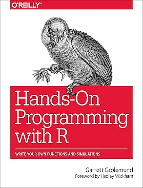
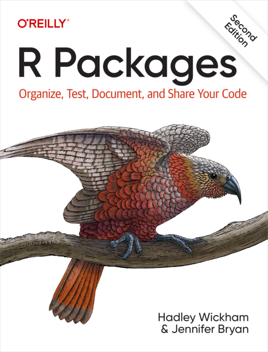

# Books

<!-- markdownlint-disable MD013 --><!-- Tables cannot be split up over lines, hence will break 80 characters per line -->

Cover                                            |Book                                                             |Audience
-------------------------------------------------|-----------------------------------------------------------------|--------------------------------
|[Hands-on programming](https://rstudio-education.github.io/hopr/)|Those that have never programmed
    |**[R for data science](https://r4ds.hadley.nz/)**                |Beginners
                    |[R packages](https://r-pkgs.org/)                                |Intermediate
                    |[Advanced R](https://adv-r.hadley.nz/)                           |Advanced

<!-- markdownlint-enable MD013 -->

- In **bold** the book we use in this course

