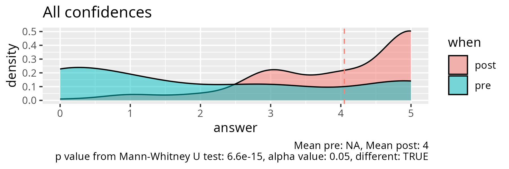

# Evaluation 2025-04-04

## Raw data

- Number of learners: 14
- Number of evaluation results: 12 (86% filled in)
- [Starting condidences](start.csv)
- [Final condidences and feedback](final.csv)

## Analysis

- Reflections: [Richèl](../../reflections/20250404/README.md)
- [R analysis script](analyse.R)
- [Statistics per learning outcome](stats.csv)
- Success score: ~80%

## Any other feedback?

- Great session!
- I like your personality and the way of teaching :)
- I like the course!
- very interactive and informative. Though require more time
- It was nice that the course was interactive and that it was possible
  to do the course at different levels.
  It might be an option to let us read the first chapter of the R
  for data science book, so there is more time to practice.
- It was really interactive and helpful session.
  All the resources have made R use easy.
- Nice and detailed introduction that picks everyone up at their level.
  Could be made voluntary so people with established skill
  set can feel free to skip it.
- Interesting and helpful 2 hours, I would have liked a few more!
  Very valuable to get known to the book 'R for data science',
  I will definitely continue reading it!
- Thank you for the course day!
  I wish I had something similar when I was very new to R.
  Having different skill levels from the beginning
  could have made it more interesting,
  but it was still enjoyable to learn proper terms
  for things I didn't know yet, as I am mostly self-taught in R.
