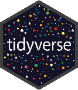
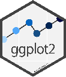

# Intro to R course

This course introduces the foundations of the R programming language
from a Tidyverse-first approach.

[Learning outcomes](learning_outcomes.md){ .md-button .md-button--primary }
[Prerequisites](prerequisites.md){ .md-button .md-button--primary }
[Course dates](course_dates.md){ .md-button .md-button--primary }
[Schedule](schedule.md){ .md-button .md-button--primary }
[Evaluation](evaluation.md){ .md-button .md-button--primary }
[Contact us](contact_us.md){ .md-button .md-button--primary }

