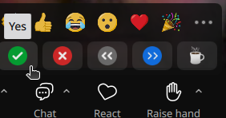

# Introduction

!!!- info "Learning outcomes"

    - Understand the goal of the course
    - Read the learning outcomes of the course

???- question "For teachers"

    Teaching goals are:

    - Learners have heard to goal of the course
    - Learners have filled in the initial confidence form

    Prior question:

    - What is R?
    - What are features of R?
    - What is the Tidyverse?
    - What are features of the Tidyverse?

## Goal of this course

Feel comfortable to learn R from a Tidyverse-first approach.

## Exercises

### Exercise 1

- Fill in
  [the initial confidence form](https://docs.google.com/forms/d/e/1FAIpQLSdGrw7oxWhT8cCKJ87XNIE1JWExgy0P7CgLbtVJf5N0Zrr0pQ/viewform?usp=header)

???- question "For teachers: what is in that form?"

    These are the questions to measure your initial confidence.
    The goal of these questions is to introduce the course's teaching goals.

    Give you confidence levels of the following statements,
    using this scale:

    - 0: I don't know even what this is about ...?
    - 1: I have no confidence I can do this
    - 2: I have low confidence I can do this
    - 3: I have some confidence I can do this
    - 4: I have good confidence I can do this
    - 5: I absolutely can do this!

    Give you confidence levels of the following statements below:

    - I feel comfortable with the book 'R for Data Science'
    - I feel comfortable with using the `swirl` package
    - I can use `ggplot2` for simple plots
    - I can create simple ggplots from tidy data
    - I can use some ggplot aesthetics
    - I can use some ggplot geometrical objects
    - I can assign a value to a variable
    - I can tell what snake case is
    - I can write a comment
    - I can correct typos in simple code
    - I can use the pipe operator
    - I can use a filter
    - I can use the logical equal operator
    - I can read a file

- In Zoom, show with the green checkmark that you are done

-
