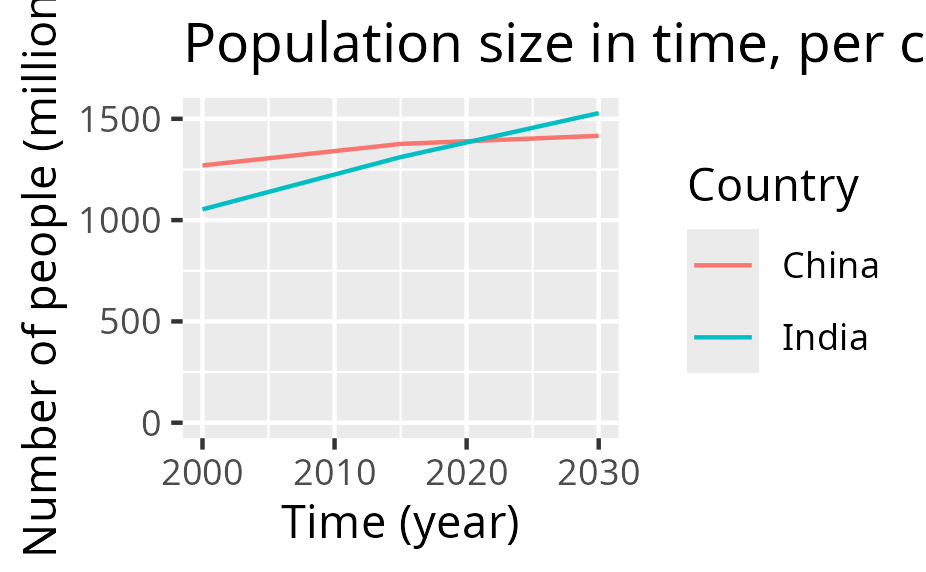
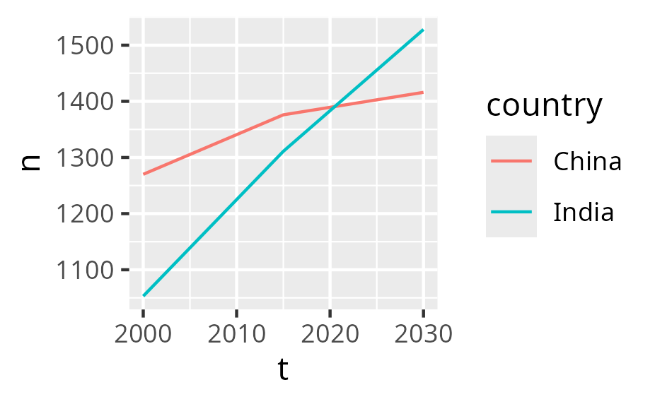

# Introduction

!!!- info "Learning outcomes"

    - Learners have created a plot from their data
    - Learners have used the book
      ['R for Data Science'](https://r4ds.hadley.nz/) for things they need

???- question "For teachers"

    Teaching goals are:

    - Repeat previous session

    Repeat:

    - What is `ggplot2`?
    - What is `gg` in `gplot2`?
    - Why use `ggplot2` for plotting?
    - In `ggplot2` terminology, what is an aesthetics?
    - In `ggplot2` terminology, what is a geometrical objects?

    Prior question:

    - .


## Goal of today

To create a plot from your data.

???- question "Could you give an example?"

    From this data ...

    Country  |2000|2015|2030
    ---------|----|----|----
    China    |1270|1376|1416
    India    |1053|1311|1528

    and [some R code](introduction_2.R) to create this figure ...

    

    after which the figure (as an SVG) can be worked upon in other tools.

## A typical project visualization

You want to visualize past and predicted
population size by country, using
[the data from the Wikipedia article 'World population'](https://en.wikipedia.org/wiki/World_population)

These are the steps:

- [1. Preparing the data](#1-preparing-the-data)
- [2. Reading the data](#2-reading-the-data)
- [3. Tidying the data](#3-tidying-the-data)
- [4. Cleaning the data](#4-cleaning-the-data)
- [5. Saving the plot](#5-saving-the-plot)
- [6. Refine](#6-refine)

## 1. Preparing the data

You (wisely) decide to start with only a subset of
[the data from the Wikipedia article 'World population'](https://en.wikipedia.org/wiki/World_population):

Country  |2000|2015|2030
---------|----|----|----
China    |1270|1376|1416
India    |1053|1311|1528

From the context, you understand that:

- the columns with numbers (e.g. `2000`) is the years
- the values in the cells are the estimated population size,
  in millions

This data is best saved as a comma-separated (`.csv`) file.
If your data is in a spreadsheat (e.g. Calc or Excel),
you can typically export your data as a (`.csv`) file.

## 2. Reading the data

When the data is saved as a `.csv` file called
[`introduction_2.csv`](introduction_2.csv),
you can read this data in R like this:

```R
library(readr)
t <- read_csv("introduction_2.csv")
```

Now you data is in a table called `t`.

Reading the data is described in
[Chapter 7: Data Import](https://r4ds.hadley.nz/data-import.html).

## 3. Tidying the data

The data must be transformed to be tidy, which
[holds these features](https://r4ds.hadley.nz/data-tidy.html#sec-tidy-data):

- Each variable is a column; each column is a variable.
- Each observation is a row; each row is an observation.
- Each value is a cell; each cell is a single value. 

Our data is not tidy yet:

|Country | 2000| 2015| 2030|
|:-------|----:|----:|----:|
|China   | 1270| 1376| 1416|
|India   | 1053| 1311| 1528|

Our data is not tidy yet, as we have three observations per row:

- The population in each in the year 2000
- The population in each in the year 2015
- The population in each in the year 2039

In R, we can make this tidy in many ways, for example:

```R
library(tidyr)
t <- t |> pivot_longer(
  cols = c("2000", "2015", "2030")
)
```

Now the data is tidy like this:

|Country |name | value|
|:-------|:----|-----:|
|China   |2000 |  1270|
|China   |2015 |  1376|
|China   |2030 |  1416|
|India   |2000 |  1053|
|India   |2015 |  1311|
|India   |2030 |  1528|

Transforming the data is described in:

- [Chapter 3: Data Transformation](https://r4ds.hadley.nz/data-transform.html)
- [Chapter 5: Data Tidying](https://r4ds.hadley.nz/data-tidy.html)

## 4. Cleaning the data

We need to clean the data, as plotting the data as such will fail:

```r
library(ggplot2)
ggplot(t, aes(x = name, y = value, color = Country)) + geom_line() # Will fail
```

We do some data transformations:

```
names(t) <- c("country", "t", "n")
t$country <- as.factor(t$country)
t$t <- as.numeric(t$t)
```

Now the data looks like:

|country |    t|    n|
|:-------|----:|----:|
|China   | 2000| 1270|
|China   | 2015| 1376|
|China   | 2030| 1416|
|India   | 2000| 1053|
|India   | 2015| 1311|
|India   | 2030| 1528|

Plotting this now works:

```r
ggplot(t, aes(x = t, y = n, color = country)) + geom_line()
```

## 5. Saving the plot

After having plotted the plot, it can be saved as such:

```R
ggsave("my_plot.svg")
ggsave("my_plot.png")
```

## 6. Refine

The plot looks like this now:



You can refine it in many ways:

- Refine the SVG in another tool
- Refine the generation of the plot

For example, in R:

```R
ggplot(t, aes(x = t, y = n, color = country)) +
  geom_line() +
  geom_point() +
  scale_x_continuous("Time (year)") +
  scale_y_continuous("Population size (million)", limits = c(0, NA)) +
  labs(title = "Population size in time", color = "Country")
```

Now the plot has proper labels:


Refining the looks of your plot is described in:

- [Chapter 11: Communication](https://r4ds.hadley.nz/communication.html)

As there is so much to tweak, you definitely need to search the web
and/or use an AI.

## Exercises

### Exercise 1

Create the plot you need for this course.
Follow the steps at [the 'A typical project visualization' section](#a-typical-project-visualization).
Read the chapters if needed and/or search the web and/or use an AI to get what
you need.
