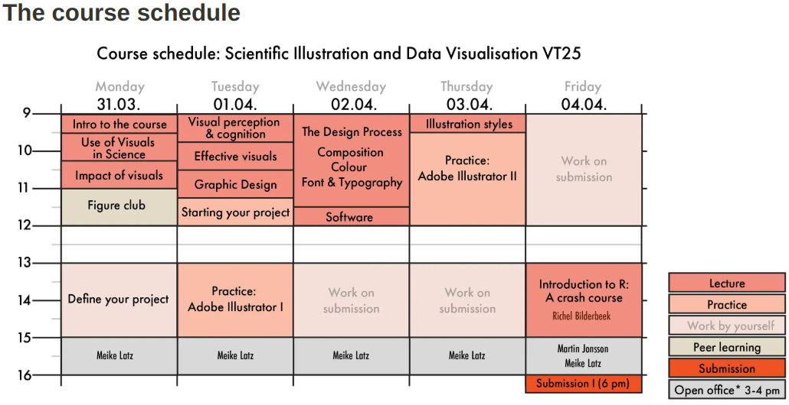

# Lesson plan

Learning outcomes:

- Prerequisites: installing tidyverse, use RStudio
- using R for data science chapters 1, 2, 3, 7
- using `swirl`

Lesson setup:

- Expect 5-20 learners
- Embrace diversity of learners
    - put them in breakout rooms in groups of 2
    - encourage exploring by themselves
    - be clear what content is shared,
    - encourage groups to look for topics of both interest

To do:

- [x] Prepare priors
- [x] Prepare feedback

Only now do I see that this course will be until 15:00.
Or **can** I have them until 16:00?

