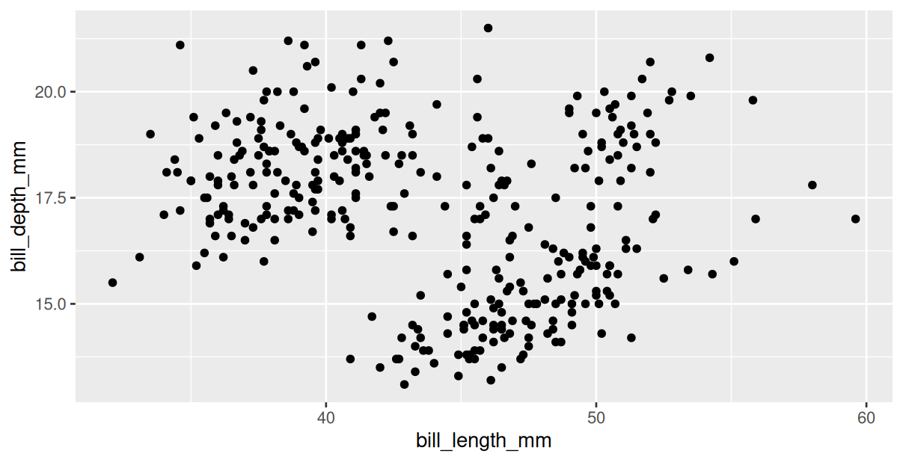
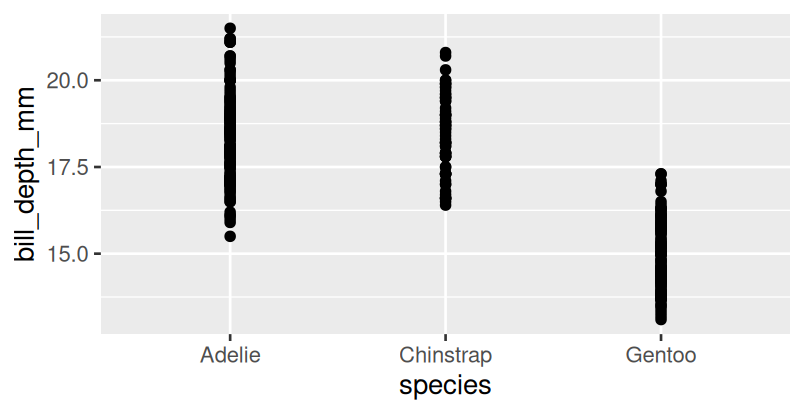
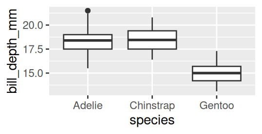

# Session 1

!!!- info "Learning outcomes"

    - .

???- question "For teachers"

    Teaching goals are:

    - .

    Prior and feedback question:


    - What is the most used use R package for plotting?
    - What is `gg` in `ggplot2`?

    Lesson plan:

    - .

## Why?

## Exercises


### Exercise 1

Read [R for data science, chapter 1](https://r4ds.hadley.nz/data-visualize.html)
until the exercises of 1.2.5


#### 1.2.5.1

How many rows are in penguins? How many columns?


???- question "Answer"

    First, install the R package:

    ```r
    install.packages("palmerpenguins")
    ```

    Second, load the R package:

    ```r
    library(palmerpenguins)
    ```

    Now, we can view the `penguins` data:

    ```r
    penguins
    ```
    
    This shows:

    ```text
    # A tibble: 344 × 8
       species island    bill_length_mm bill_depth_mm flipper_length_mm
       <fct>   <fct>              <dbl>         <dbl>             <int>
     1 Adelie  Torgersen           39.1          18.7               181
     2 Adelie  Torgersen           39.5          17.4               186
     3 Adelie  Torgersen           40.3          18                 195
     4 Adelie  Torgersen           NA            NA                  NA
     5 Adelie  Torgersen           36.7          19.3               193
     6 Adelie  Torgersen           39.3          20.6               190
     7 Adelie  Torgersen           38.9          17.8               181
     8 Adelie  Torgersen           39.2          19.6               195
     9 Adelie  Torgersen           34.1          18.1               193
    10 Adelie  Torgersen           42            20.2               190
    # ℹ 334 more rows
    # ℹ 3 more variables: body_mass_g <int>, sex <fct>, year <int>
    # ℹ Use `print(n = ...)` to see more rows
    ```

    The tibble has 344 rows and 8 columns, hence the answers are 344
    and 8 respectively.


#### 1.2.5.2

What does the `bill_depth_mm` variable in the `penguins` data frame describe?
Read the help for `?penguins` to find out.

???- question "Answer"

    In R -indeed- type:

    ```r
    ?penguins
    ```

    In the bottom-left 'Help' panel,
    one can find:

    > a number denoting bill depth (millimeters)

???- question "Prettier answer"

    Go to the website of the `palmerpenguins` R package
    at
    [https://allisonhorst.github.io/palmerpenguins/](https://allisonhorst.github.io/palmerpenguins/).

    There, you'll see a picture of what bill depth looks like.


#### 1.2.5.3

Make a scatterplot of `bill_depth_mm` vs. `bill_length_mm`. 

That is, make a scatterplot with `bill_depth_mm` on the y-axis and
`bill_length_mm` on the x-axis.

???- question "Answer"

    First, activate the `ggplot2` package:

    ```r
    library(ggplot2)
    ```

    Then, start with this code in section 1.2.3:

    ```r
    ggplot(
      data = penguins,
      mapping = aes(x = flipper_length_mm, y = body_mass_g)
    ) +
      geom_point()
    ```

    Then, replace `flipper_length_mm` by `bill_length_mm`
    and `body_mass_g` by `bill_depth_mm`:

    ```r
    ggplot(
      data = penguins,
      mapping = aes(x = bill_length_mm, y = bill_depth_mm)
    ) +
      geom_point()
    ```

    This will look like:

    

Describe the relationship between these two variables.

???- question "Answer"

    It seems that there are at least 2 groups.

    It is hard to determine if there is a relationship at all.

#### 1.2.5.4

What happens if you make a scatterplot of `species` vs. `bill_depth_mm`? 

???- question "Answer"

    Start with this code in section 1.2.3:

    ```r
    ggplot(
      data = penguins,
      mapping = aes(x = flipper_length_mm, y = body_mass_g)
    ) +
      geom_point()
    ```

    Then, replace 

    ```r
    ggplot(
      data = penguins,
      mapping = aes(x = species, y = bill_depth_mm)
    ) +
      geom_point()
    ```

    This will look like:

    

What might be a better choice of `geom`?

???- question "Answer"

    Using `geom_boxplot`:

    ```r
    ggplot(
      data = penguins,
      mapping = aes(x = species, y = bill_depth_mm)
    ) +
      geom_boxplot()
    ```

    This will look like:

    


#### 1.2.5.5

Why does the following give an error and how would you fix it?

```r
ggplot(data = penguins) + 
  geom_point()
```

???- question "Answer"

    The error will be:

    ```r
    Error in `geom_point()`:
    ! Problem while setting up geom.
    ℹ Error occurred in the 1st layer.
    Caused by error in `compute_geom_1()`:
    ! `geom_point()` requires the following missing aesthetics: x
      and y.
    Run `rlang::last_trace()` to see where the error occurred.
    ```

    This can be fixed by specifying what the `x` and `y` aesthetics
    are, for example:

    ```r
    ggplot(
      data = penguins,
      mapping = aes(x = flipper_length_mm, y = body_mass_g)
    ) +
      geom_point()
    ```

#### 1.2.5.6

What does the `na.rm` argument do in `geom_point()`? 

What is the default value of the argument? Create a scatterplot where you successfully use this argument set to TRUE.

#### 1.2.5.7

Add the following caption to the plot you made in the previous exercise: “Data come from the palmerpenguins package.” Hint: Take a look at the documentation for labs().

#### 1.2.5.8

Recreate the following visualization. What aesthetic should bill_depth_mm be mapped to? And should it be mapped at the global level or at the geom level?

A scatterplot of body mass vs. flipper length of penguins, colored  by bill depth. A smooth curve of the relationship between body mass  and flipper length is overlaid. The relationship is positive,  fairly linear, and moderately strong.

#### 1.2.5.9

Run this code in your head and predict what the output will look like. Then, run the code in R and check your predictions.

```r
ggplot(
  data = penguins,
  mapping = aes(x = flipper_length_mm, y = body_mass_g, color = island)
) +
  geom_point() +
  geom_smooth(se = FALSE)
```

#### 1.2.5.10

Will these two graphs look different? Why/why not?

```r
ggplot(
  data = penguins,
  mapping = aes(x = flipper_length_mm, y = body_mass_g)
) +
  geom_point() +
  geom_smooth()

ggplot() +
  geom_point(
    data = penguins,
    mapping = aes(x = flipper_length_mm, y = body_mass_g)
  ) +
  geom_smooth(
    data = penguins,
    mapping = aes(x = flipper_length_mm, y = body_mass_g)
  )
```

